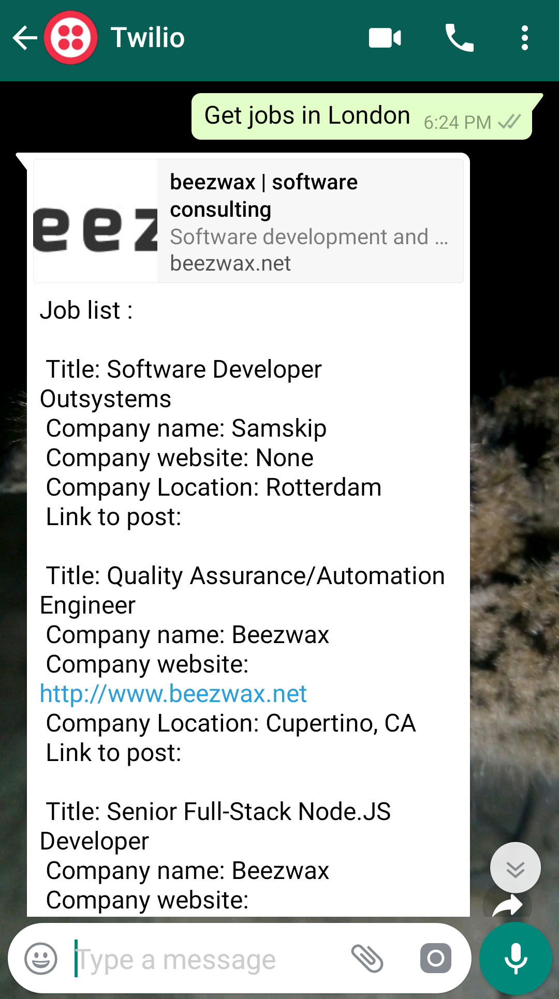
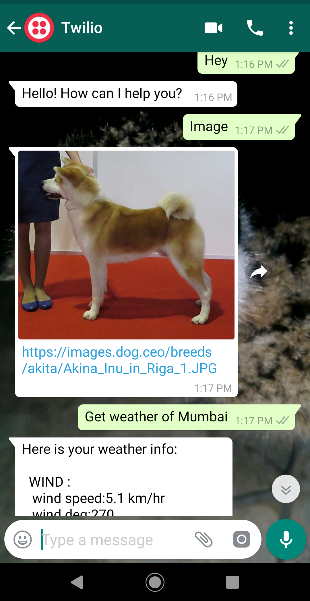
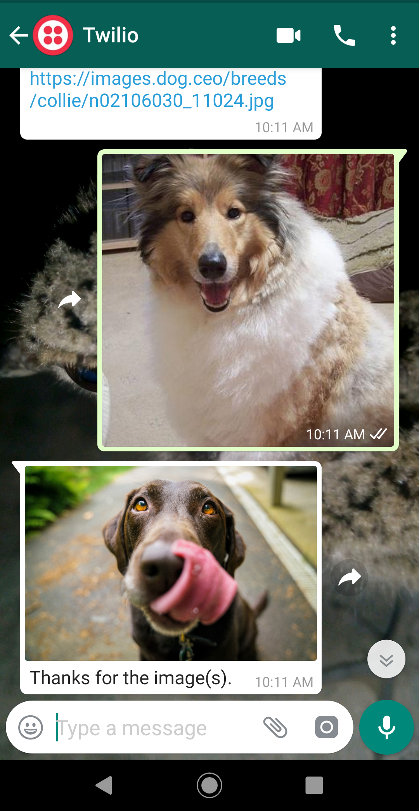
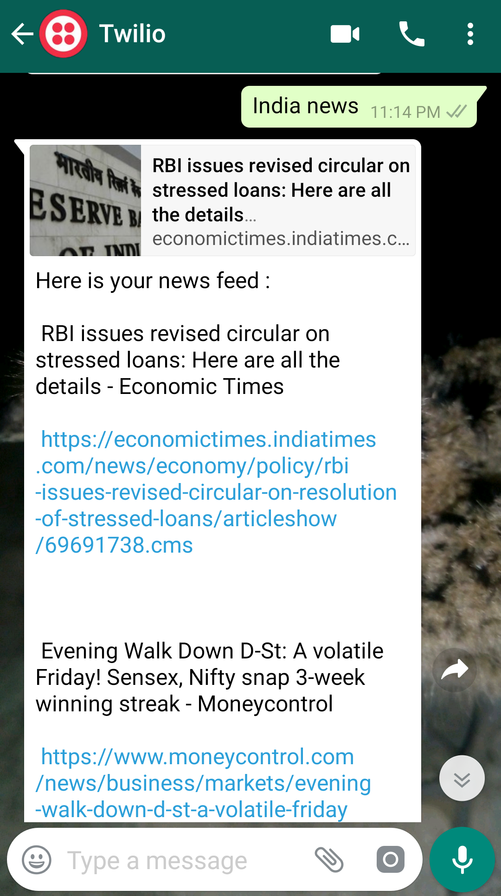

# WHATSAPP BOT

## Made in Python
#####  WITH
* Flask
* Twilio
* Dialogflow
* ngrok

## How To Access:
#### 1. Open Whatsapp
#### 2.  Send a  **WhatsApp message** to  +1 415 523 8886 with code 
```
join  point-earn
```

####  3. The bot is now connected, and you can ask/talk to him on the following topics 
   * Get weather 
   * Get news
   * Get any random image
   * Get jobs  **_( any city/state mainly in Australia, North America, Europe)_**
   * You could send an image to get a reply
   
  _Conversation example_ 
  ```
  Get weather of Delhi
  send me image
  get a random dog
  i need a job in london
  get java jobs in uk
  Get me telugu news
  ```
    
  
  
  
  
